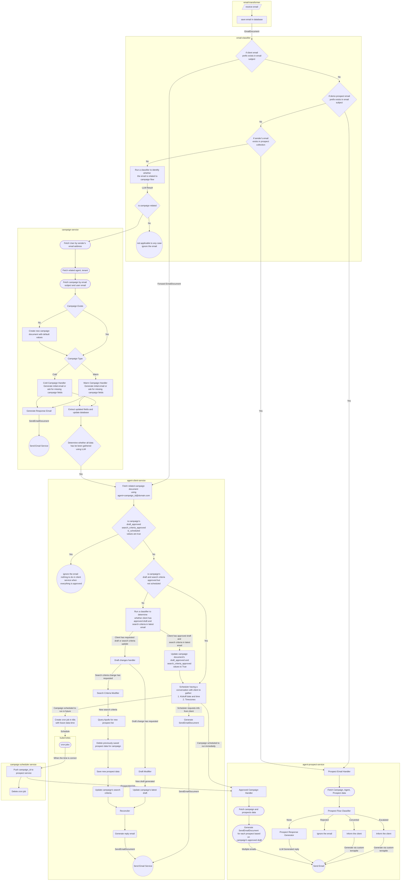

# Overall functional flow

Functional breakdown of the overall system.

```mermaid
flowchart TD
    subgraph email-transformer
        etr[/receive email/]
        ets[save email in database]
        etr --> ets
    end

    subgraph agent-prospect-service
        apeh[Prospect Email Handler]
        apac[Approved Campaign Handler]

        apse((Send Email))

        apfc([Fetch Campaign, Agent, Prospect data])
        appfc[Prospect Flow Classifier]
        appfc1[Inform the client]
        appfc2[Inform the client]
        appfc3[Ignore the email]
        appfc4[Prospect Response Generator]

        apfcp([Fetch campaign and prospects data])
        apgpe([Generate SendEmailDocument \n for each prospect based on \n campaign's approved draft])

        apeh --> apfc
        apfc --> appfc
        appfc -->|Escalated| appfc1
        appfc -->|Converted| appfc2
        appfc -->|Rejected| appfc3
        appfc -->|None| appfc4
        appfc1 -->|Generate via custom \n temaplte| apse
        appfc2 -->|Generate via custom \n temaplte| apse
        appfc4 -->|LLM Generated reply| apse

        apac --> apfcp
        apfcp --> apgpe
        apgpe -->|Multiple emails| apse

    end

    subgraph email-classifier
        eccl{if client email \n prefix exists in email \n subject}
        ecpd{if demo prospect email \n prefix exists in email \n subject}
        ecp{if sender's email \n exists in prospect \n collection}
        ecc[Run a classifier to identify whether \n the email is related to campaign flow]
        eccam{is campaign related}
        ecstop((not applicable to any case \n ignore the email))
    
        ets -->|EmailDocument| eccl
        eccl -->|No| ecpd
        ecpd -->|Yes| apeh
        ecpd -->|No| ecp
        ecp -->|Yes| apeh
        ecp -->|No| ecc
        ecc -->|LLM Result| eccam
        eccam -->|No| ecstop
    end


    subgraph agent-client-service
        acs(Fetch related campaign document \n using agent+campaign_id@domain.com)
        acc1{is campaign's \n draft_approved \n search_criteria_approved \n is_scheduled \n values are true}
        ecs1((ignore the email \n nothing to do in client service when \n everything is approved))
        acc2{is campaign's \n draft and search criteria \n approved but \n not scheduled}
        
        accl1[Run a classifier to determine \n whether client has approved draft and \n search criteria in latest email]
        acs1[Scheduler having a conversation with client to gather: \n 1. Kickoff date and time \n 2. Timezones]
        acs1r1(Generate SendEmailDocument)
        acs1r3(Create cron job in k8s \n with future data time)
        accl1r1(Update campaign document's \n draft_approved and search_criteria_approved \n values to True)
        
        acdh[Draft changes handler]
        acdm[Draft Modifier]
        acdmr(Update campaign's latest draft)
        acsm[Search Criteria Modifier]
        acsmr1[Query Apollo for new prospect list]
        acsmr2(Delete previously saved prospect data for campaign)
        acsmr3(Save new prospect data)
        acsmr4(Update campaign's search critieria)
        acr[Reconciler]
        acrr(Generate reply email)
        acse((Send Email Service))


        eccl -->|Forward EmailDocument| acs
        acs --> acc1
        acc1 -->|Yes| ecs1
        acc1 -->|No| acc2
        acc2 -->|Yes| acs1
        acc2 -->|No| accl1
        accl1 -->|Client has approved draft and \n search criteria in latest email| accl1r1
        accl1 -->|Client has requested \n draft or search criteria update| acdh
        accl1r1 --> acs1
        acs1 -->|Scheduler requests info from client| acs1r1
        acs1r1 -->|SendEmailDocument| acse
        acs1 -->|Campaign scheduled to run immediatly| apac
        acs1 -->|Campaign scheduled to run in future| acs1r3
        acs1r3 -->|Schedule| kubernetes

        acdh -->|Draft change has requested| acdm
        acdm -->|New draft generated| acdmr
        acdh -->|Search criteria change has requested| acsm
        acsm -->|New search criteria| acsmr1
        acsmr1 --> acsmr2
        acsmr2 --> acsmr3
        acsmr3 --> acsmr4
        acdmr --> acr
        acsmr4 --> acr
        acr --> acrr
        acrr -->|SendEmailDocument| acse
    end

    subgraph kubernetes
        k8s([cron jobs])
    end

    subgraph campaign scheduler service
        css1[Push campaign_id to prospect service]
        css2(Delete cron job)

        k8s -->|When the time is correct| css1
        css1 --> css2
        css1 -->|ProspectInitJob| apac
    end

    subgraph campaign-service
        cass1([Fetch User by sender's email address])
        cass2([Fetch related agent, tenant])
        cass3([Fetch campaign by email subject and user email])
        casce{Campaign Exists}
        cascec[Create new campaign document with default values]
        cascc{Campaign Type}
        casw[Warm Campaign Handler \n Generate initial email or ask for missing \n campaign fields]
        casc[Cold Campaign Handler \n Generate initial email or ask for missing \n campaign fields]
        cascf[Extract updated fields and update database]
        casgr[Generate Response Email]
        casse((Send Email Service))
        cascs{Determine whether all data \n has be been gathered using LLM}


        eccam --> cass1
        cass1 --> cass2
        cass2 --> cass3
        cass3 --> casce
        casce --> |Yes| cascc
        casce -->|No| cascec
        cascec --> cascc
        cascc -->|Warm| casw
        cascc -->|Cold| casc
        casc --> cascf
        casw --> cascf
        cascf --> cascs
        casw --> casgr
        casc --> casgr
        casgr -->|SendEmailDocument| casse
        cascs -->|Yes| acs

    end


```